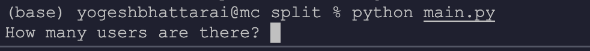
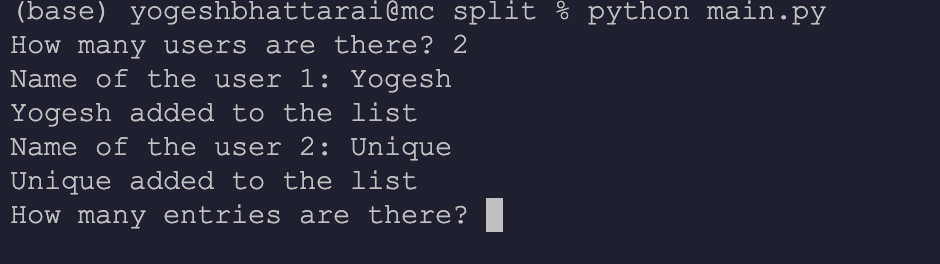
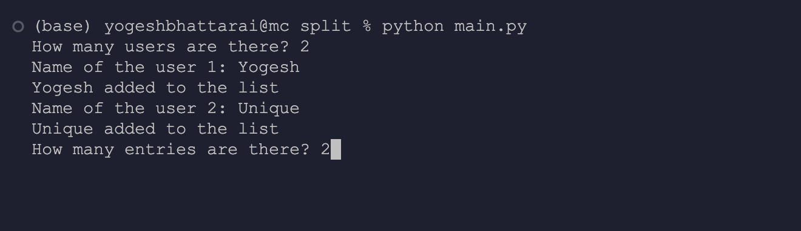
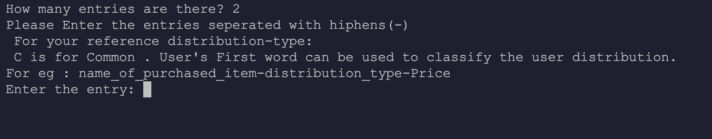
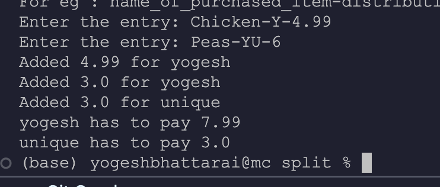

# Splitwise Python Application

## Version Number 1.0.0

## Overview

This Python application provides a simple way to split an amount equally or sub-equally among participants in entries. It can be used for various purposes such as splitting bills, expenses, or any shared costs among a group of people.

## Features

- **Equal Split**: Split the total amount equally among participants.
- **Sub-equal Split**: Split the total amount sub-equally among participants based on their specified shares.
- **Add Participants**: Add participants and their respective shares.
- **Calculate Split**: Perform the split calculation and display the results.

## Installation

1. Clone the repository:

   ```
   git clone https://github.com/uniquemozilla22/Splitwise_PY.git
   ```

2. Navigate to the project directory:
   ```
   cd Splitwise_PY
   ```

## Usage

1. Run the application:

   ```
   python main.py
   ```

2. Enter the number of participants/ users for the application.
   
   Note: The input should be in number(int) format

3. Enter the name of the users
   
   Note: The user's name should be different. The application uses the first name basis to divide the price into the users.

4. Enter the number of entries in the bill. Let us consider there are 2 split's between 2 users then we can write 2 in the number of entries
   

5. Choose the splitting method:
   

```python
<item_name>-<split_users_first_letter_of_first_name>-<price_in_float>
```

- **Equal Split**: Split the amount equally among participants. Just add their firstname on the partitioning format

- **Sub-equal Split**: Split the amount sub-equally based on specified shares.If a user doesnot participates on the split then just not mentioning their name will not include the user on the participation.

For Example:
I have a bill of 2 things, chicken which is only for Yogesh and Peas are distributed among Yogesh and Unique then the entries would look like:


4. View the split results.

## Contributing

Contributions are welcome! If you have any suggestions, bug reports, or feature requests, please open an issue or submit a pull request on [GitHub](https://github.com/uniquemozilla22/Splitwise_PY.git).

## License

This project is licensed under the MIT License. See the [LICENSE](LICENSE) file for details.

## Contact

For any inquiries or assistance, feel free to contact the project maintainer at [Gmail](mailto:bhattaraiyogesh007@gmail.com).
